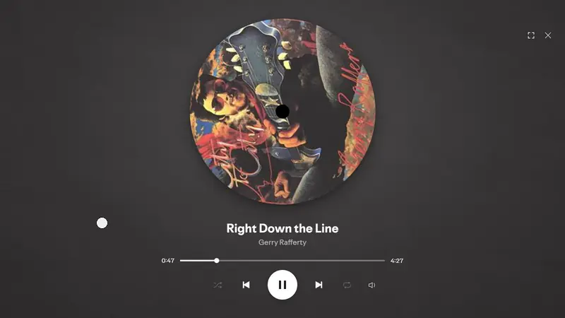

# Vinyl Rewind

A fullscreen spinning record for Spotify. Grab the record and turn it to rewind or fast-forward the song, like a real turntable.



## Features

- **Scratch to scrub**: grab the record and it stops instantly. Turn it backwards to rewind, forwards to fast-forward, and let go to carry on playing. One full turn is 24 seconds of the song. You can also scroll over the record to nudge it.
- **Rewind sound**: a soft tape-rewind rumble that follows how fast you turn.
- **Next record**: the next song waits just off the right edge and peeks in now and then. Move the mouse near it to bring it in, then click or drag it in to skip. Skipping rolls the current record out and the new one in.
- **Synced lyrics**: when the controls are hidden, the current lyric line shows under the record.
- **Album colors**: the background takes its color from the cover art, with a faint paper texture that changes with every song. Both fade smoothly when the track changes.
- **Idle mode**: leave the mouse alone for 3 seconds and the record takes center stage; everything except the progress bar fades away. When a new song starts, its name shows for a moment.
- **Full controls**: progress bar (hover it to see the time at any point), shuffle, previous, play/pause, next, repeat, and a volume control that expands on hover.
- **Built in**: a Vinyl mode section in Spotify's Settings (or right-click the record button for quick settings), a card in Home > Getting started, and full keyboard control.

## Install

### Spicetify Marketplace

Search for **Vinyl Rewind** in the Marketplace and install it.

### Manually

1. Download `rewind.js` and put it in your Spicetify `Extensions` folder:
   - Windows: `%appdata%\spicetify\Extensions`
   - macOS / Linux: `~/.config/spicetify/Extensions`
2. Run:

   ```bash
   spicetify config extensions rewind.js
   spicetify apply
   ```

## Usage

Click the record icon in the playbar, press `Alt + Shift + V`, or use **Try it** on the Vinyl mode card in Home > Getting started. You can also have it open by itself whenever you start playing music (Settings > Vinyl mode).

| Action | Result |
| --- | --- |
| Grab the record | Stops it (and the music) |
| Turn it backwards / forwards | Rewind / fast-forward |
| Let go | Music continues from the new spot |
| Scroll over the record | Nudge it: down skips ahead, up rewinds (2 s per notch) |

### Keyboard

| Key | Action |
| --- | --- |
| `Alt + Shift + V` | Open or close Vinyl mode |
| `←` / `→` | Rewind / fast-forward 5 seconds (hold `Shift` for 15) |
| `N` / `P` | Next / previous song |
| `L` | Like or unlike the song (a heart pops on the record) |
| `Space` | Play / pause |
| `↑` / `↓` | Volume |
| `M` | Mute |
| `F` | Full screen |
| `Esc` | Leave full screen, then close |
| `?` | Show all keyboard shortcuts |
| `Tab` | Reach the next-song record, then `Enter` to skip |

## Settings

Open Spotify **Settings** and scroll to **Vinyl mode**, or right-click the record button in the playbar for quick settings.

| Setting | Default |
| --- | --- |
| Open Vinyl mode when music starts | Off |
| Rewind sound while scratching | On |
| Hide controls when the mouse is idle | On |
| Show lyrics when controls are hidden | On |
| Show the next song at the screen edge | On |
| Reduce motion | Follows your system |

The Home card can be dismissed with **Not now**.

Scratching is turned off automatically when Spotify doesn't allow seeking (ads, some radio and DJ sessions), and controls that aren't available in the current context are dimmed.

## Performance

The record spins on the GPU, so it stays smooth at your display's full refresh rate, and it follows your mouse as fast as the mouse reports. Song changes and scratching are free of long stalls, even when skipping quickly. While Vinyl mode is open, Spotify's hidden interface is paused out of layout; while it is closed, Vinyl Rewind does no work at all.

## Uninstall

```bash
spicetify config extensions rewind.js-
spicetify apply
```

## License

[MIT](LICENSE)
